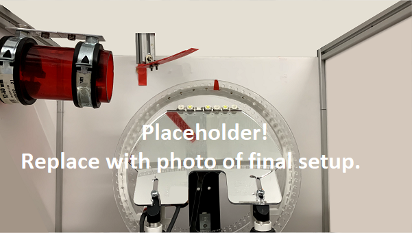
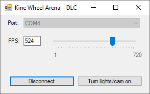
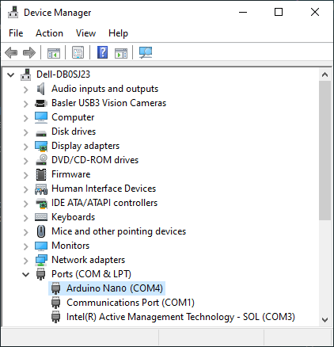
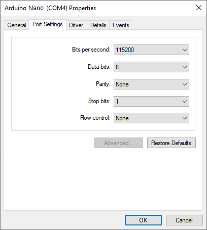
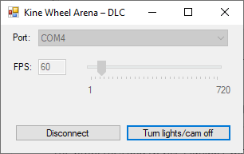
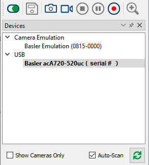
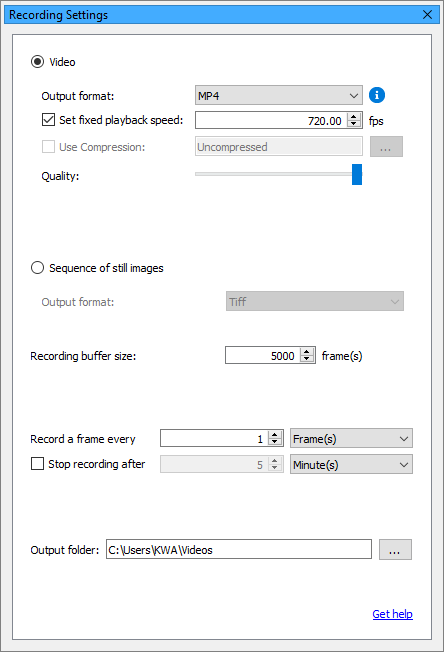
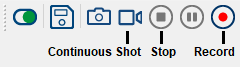

# Requirements

## Hardware

*Kine Wheel Arena – DLC* (KWA-DLC) consists of a mouse wheel, camera, lighting, a control unit (Arduino) to synchronize camera and lighting, and a surrounding box which shields the system from interference of external light sources.
Furthermore, the complimentary [software](#software) to operate the system requires a Windows machine.

> **TODO**: Replace with photo of final setup.

*Figure 2 – Photo of the experimental setup from the view of the camera.*

## Software

For running the system, a Windows machine with the following software installed is required:

- [KWA-Controller App](#kwa-controller-app) – A Graphical User Interface (GUI) application to interface with the Basler camera and the lighting of the system by means of an Arduino. Required for preparing the KWA-DLC system for recording.
- [pylon Viewer](#pylon-viewer) – Basler's camera software suit for configuring and recording on Basler cameras. Required for recording video to storage and loading camera configuration.
- [Anaconda/Miniconda](#anacondaminiconda) – A package and environment management system for Python (and other languages). Required for setting up a Python environment needed to perform tracking of mouse paws in recorded videos.

*Note:* All software listed above can be downloaded free of charge.

### KWA-Controller App

The *KWA-Controller* app is a small Windows application with a graphical user interface, which allows the user to control the lighting and the camera's rate at which it is capturing images.
It is required to get the system ready to record videos using [pylon Viewer](#pylon-viewer).
The application requires no installation but needs [Microsoft .NET Framework 4.8 Runtime](https://dotnet.microsoft.com/en-us/download/dotnet-framework/net48).
A compiled version of the program for Windows 64-bit OS is available for download on the GitHub Releases page.

*Figure 3a – The graphical user interface of the KWA-Controller app.*

#### Usage

First, ensure that the *KWA-DLC* control unit (Arduino) is connected the Windows machine on which to record video.

Next, determine the COM port on which the control unit is connected to by opening the Windows *Device Manager* (type `devmgmt.msc` in the Windows search bar), expanding the *Ports (COM & LPT)* section, and writing down the port name shown in parentheses, right next to a port labelled as *Arduino Nano* (Figure 3b).

*Figure 3b – Expanded "Ports (COM & LPT)" section in the Windows Device Manager. The selected port, labelled "Arduino Nano", is assigned to port "COM4".*

If necessary, right-click the port label and click on *Properties*, to adjust the port settings of the Arduino in the *Port Settings* tab to match the ones shown in Figure 3c.

*Figure 3c – Port Settings of the Arduino in Windows Device Manager.*

*Note:* The COM port name and the properties should not change as long as no other COM devices get connected (and the USB port the Arduino is connected to stays the same).

The properties and *Device Manager* window can now be closed.

Then, open `KWA-Controller.exe`, click on the *Port* drop-down menu, and select the port noted in *Device Manager*.
The *FPS* (Frames Per Second) value, which sets the rate at which the camera is triggered to capture a frame, can be set to a value between 1–720, using the edit box or track bar.
Note that higher values result in a larger video file size due to the higher rate at which frames are captured.

Click on *Connect* to establish communication with the Arduino. If no errors icons appear next to the form fields and the button text changes to "Disconnect", lighting and camera trigger can now be switched on/off using the button *Turn lights/cam on*; otherwise, move the mouse pointer over the error icon and read the error message, which should also provide a suggestion on how to fix the error.

*Figure 3d – The KWA-Controller app and the Arduino are communicating over port COM4. Lights are switched on and the camera is triggered at 60 Hz.*

### pylon Viewer

#### Install pylon Viewer

Download and install the software suit from the official Basler Website: [pylon Viewer](https://www.baslerweb.com/en/downloads/software-downloads/#type=pylonsoftware;language=all;version=7.2.1)

To record video in MPEG-4 file format (recommended), download and install the supplementary package for MPEG-4 from Basler's Website: [pylon Supplementary Package for MPEG-4 Windows](https://www.baslerweb.com/en/downloads/software-downloads/#type=pylonsupplementarypackageformpeg4;language=all;version=all;os=windows)

Note: The rest of this documentation assumes that the package has been installed.

#### Open Camera

Ensure that the camera is connected to the computer and listed in the *Devices* pane in pylon Viewer.
Select the camera and open it by clicking on the *Open Device* button on the toolbar (Figure 4a).

*Figure 4a – The image shows the Devices pane in pylon Viewer with the Basler acA720-520uc camera selected and ready to be opened by clicking the green Open Device button on the far left on the toolbar on top.*

#### Load Camera Features

To load the provided camera configuration, ensure that the camera device is opened and no recording is running.
Then, in the menu bar, click on *Camera* > *Load Features*.
In the open file dialog box navigate to `Camera/` in the Git repository folder and select `acA720-520uc-inference.pfs`.
Click *Open* to load the camera configuration.

#### Recording Settings

To edit the recording settings, ensure that the camera device is opened and no recording is running. Then, in the menu bar, click on *Window* > *Recording Settings*. In the *Recording Settings* pane, choose the *Video* option.

- Set the *Output Format* to *MP4* to record video in MPEG-4 file format.
- Tick the checkbox *Set Fixed Playback Speed* and set the *FPS* value to the same value set in the KWA-Controller app. This ensures that the playback of the video reflects real time and is not slowed down (FPS pylon Viewer > FPS KWA-Controller) or sped up (FPS pylon Viewer < FPS KWA-Controller). However, a mismatch between both FPS values won't affect the predictions made by the neural network during inference.
- Move the *Quality* slider to the far right position to record videos in the highest quality (lowest compression, but larger file size). Lowering the quality value can ease the system load and help with recording buffer overruns (dropped frames) on slower machines, but might lower the prediction accuracy during inference.
- Set the *Recording Buffer Size* to *5,000*. Should you encounter dropped frames during recording (see status bar of Preview pane), increase the value.
- Set *Record A Frame Every* to *1 Frame(s)*. Each frame captured by the camera will be written to video when recording.

For more details, refer to the [pylon Viewer documentation on recording](https://docs.baslerweb.com/recording).

*Figure 4b – The image shows the Recording Settings pane in pylon Viewer. The recording to video option is selected. Videos will be recorded in highest quality in MPEG-4 file format with a fixed playback speed of 720 FPS. They will be saved to `C:\Users\KWA\Videos`. Every frame captured by the camera will be written to video. The recording buffer is set to hold 5,000 frames.*

#### Record

To record video, ensure that the camera device is [opened](#open-camera), [configured](#load-camera-features), selected in the *Devices* pane, and the [Recording Settings](#recording-settings) are adjusted.

Enable the camera preview by clicking the *Continuous Shot* button (video camera icon) on the toolbar (Figure 4c)
This previews the frames in the *Preview* pane that the camera is currently capturing.
No video is being recorded yet.

To record a video, click the *Record* button (red recording icon) on the toolbar (Figure 4c).

Note that if the recording buffer size set in [Recording Settings](#recording-settings) is too small and overruns, frames will be dropped and not be part of the recorded video. The number of dropped frames is visible in the *Preview* pane during preview and recording.

To stop a recording, click the *Stop* button (circled square icon) on the toolbar (Figure 4c).

*Figure 4c – Toolbar in pylon Viewer.*

For more details, refer to the [pylon Viewer documentation on recording](https://docs.baslerweb.com/recording).

### Anaconda/Miniconda

[Download](https://conda.io/projects/conda/en/stable/user-guide/install/download.html) and install Anaconda or Miniconda for Windows from conda.io.
The difference between both versions is explained on the download page; both work with this guide.
