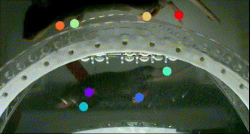

.. KineWheelArena - DLC documentation master file, created by
   sphinx-quickstart on Mon Jan  9 13:17:22 2023.
   You can adapt this file completely to your liking, but it should at least
   contain the root `toctree` directive.

Welcome to KineWheelArena - DLC's documentation!
================================================

*Kine Wheel Arena – DLC* is an open-source experimental setup for markerless paw tracking of head-fixed mice running on a wheel.
The apparatus is based on the open-source motion tracking system `(KineMouse Wheel) <https://hackaday.io/project/160744-kinemouse-wheel>`_ designed by `Richard Warren <https://richard-warren.github.io>`_.
It has been extended with a camera, lighting, and a controller to run both in synchronization.
Tracking is done using a Deep Neural Network trained with `DeepLabCut <https://www.mackenziemathislab.org/deeplabcut>`_ (DLC).
The system is available for purchase at `LABmaker <https://www.labmaker.org>`_.

*Figure 1 – Video clip showing mouse paws annotated by Deep Neural Network.*

.. toctree::
   :maxdepth: 4
   :caption: Contents
   
   Requirements
   Installation
   Usage
   License
